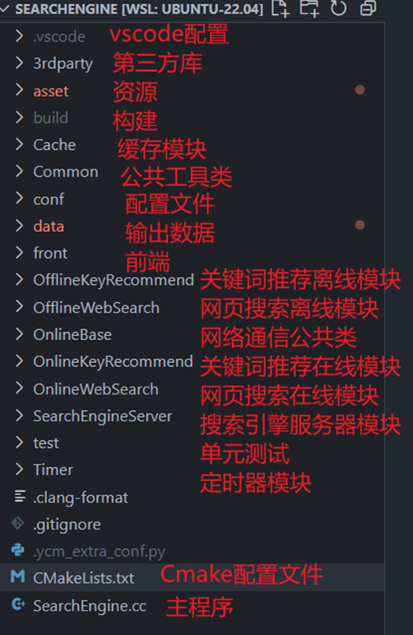
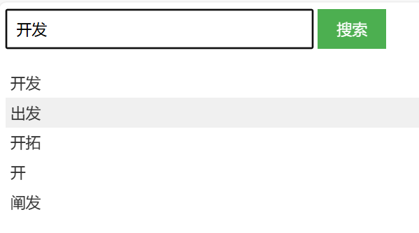
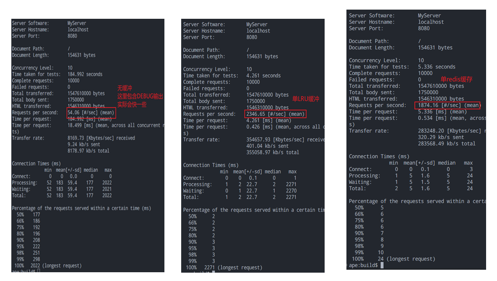
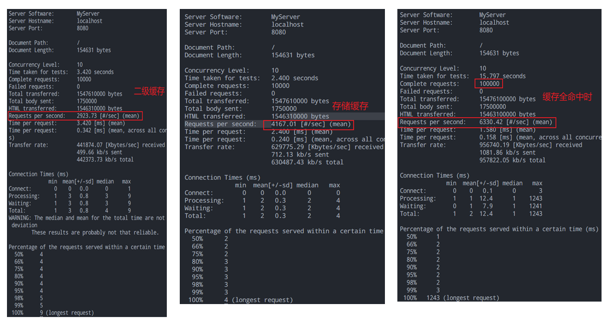

# 项目结构
- 每个模块通过子目录的cmake配置文件管理
- 通过根目录的cmake配置文件统一加载子目录配置并编译



# 编译运行

```shell
# 后端
mkdir build
cd build
cmake .. && make
# 运行SearchEngine服务器
./SearchEngine
# 启动redis服务器
redis-server

# 前端
cd front
npm install
# 运行前端
node client.js
```



# 单元测试
- 可在`build`目录下通过`make test`执行所有单元测试
- 可使用`ctest`进行独立单元测试
- 可通过`SearchEngine/build/Testing/Temporary/LastTest.log`查看测试调试信息
- 如果测试出错，可修改后通过`ctest --rerun-failed --output-on-failure`重试出错模块

# 性能测试

- `ab -n 10000 -c 10 -p ../asset/ab.json -T application/json   http://localhost:8080/`




